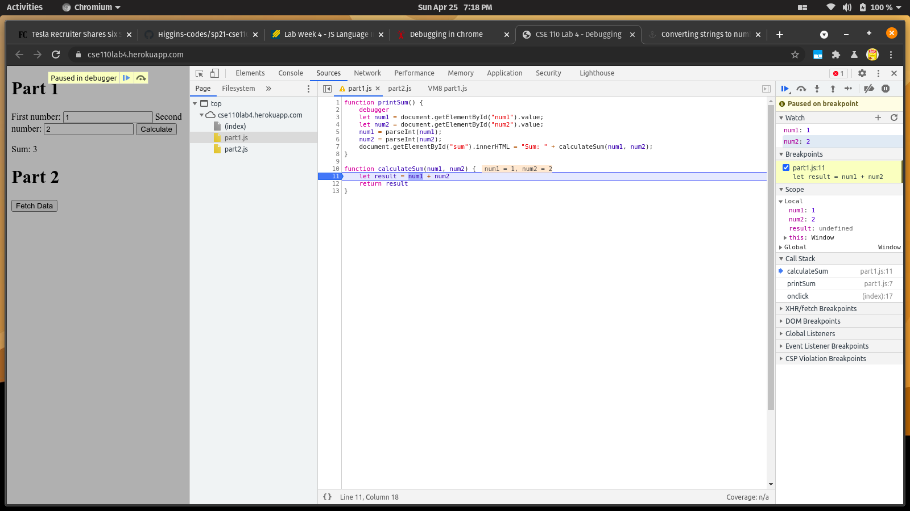

1. The `.js` file was concatenating the values instead of adding them. This is due to not converting the string inputs into numbers
2. the problem was that the values were not converted into a `number` so the solution was to add a function call to `parseInt()` on the variables storing the input values

3. `citylots.json`
4. `part2.js`
5. `11.7MB`
6. `94ms`

 
7. User-Agent: Mozilla/5.0 (X11; Linux x86_64) AppleWebKit/537.36 (KHTML, like Gecko) Chrome/90.0.4430.85 Safari/537.36 
8. Server: Apache
9. Last-Modified: Tue, 26 Jan 2021 22:14:13 GMT
10. Content-Type: application/json
11. `fetchData()` and `onclick()`